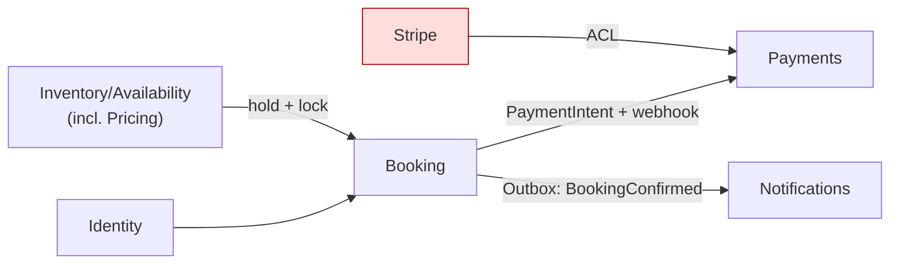

# Harbourstay Strategic Design — End-to-End Walkthrough Example

This document walks through the **Harbourstay** OTA booking domain across all six phases in **PRD mode**. It helps first-time users understand the skill flow on this specific project.

This is a *process example*, not the correct answer. The four-role debate on a real run may land on different boundaries — and it should, if the user argues differently. Treat the reasoning as the lesson, not the result.

Example output path: `docs/strategic-design/`.

---

## Phase 0: Setup

**User**: `/strategic-design` (or "start Strategic Design").

**Skill**:
- Mode: **PRD** (default). Reads `prd-harbourstay-booking-platform.md`.
- Domain: **Harbourstay** — short-stay accommodation & tour booking (OTA).
- Learning mode: Guided.
- Scope (from §1-§2): guests search → reserve → pay → confirm → cancel; hosts list and manage availability/rates. Out: multi-tenancy, deep security/compliance, real settlement, mobile app (§2 N1-N4).
- §5.1 supplies six candidate BCs → Phases 1-2 run in **validation mode**.

Output: `docs/strategic-design/` directory plus empty `STRATEGIC.md` skeleton.

---

## Phase 1: Domain Discovery (PRD-prefilled)

The skill maps PRD sections instead of asking the five questions live:

| Discovery answer | Pulled from |
|---|---|
| Actors | §4 — Guest (booker), Host/Operator (supplier), Admin (stretch) |
| Domain events | §5.2 + §5.3 |
| KPIs | §3 + §9 |
| Differentiation | §1 |
| Out of scope | §2, §6 |

### Output: `01-discovery.md`

```markdown
# Phase 1: Domain Discovery

## One-Line Definition
An OTA where guests reserve short stays/tours and hosts manage availability,
differentiated by overbooking prevention and reliable payment confirmation.

## Users
- Primary: Guest (booker)
- Secondary: Host/Operator (supplier); Admin (stretch)

## Domain Events
- HoldPlaced
- BookingCreated (PendingPayment)
- PaymentIntentCreated
- PaymentSucceeded / PaymentFailed
- BookingConfirmed
- BookingExpired (hold TTL elapsed)
- BookingCancelled
- BookingCompleted
- ConfirmationEmailRequested

## KPIs
- End-to-end booking success (search → reserve → pay test → confirm)
- Zero double-bookings (hard invariant)
- Search p95 < 500 ms

## Scope
- In: identity/roles, listing search & availability, booking lifecycle,
  Stripe test payment + webhook, outbox-driven notifications, host management
- Out: multi-tenancy, deep security/compliance, real settlement/refunds, mobile
```

### Output: `initial-bc-guess.md` (user writes this BEFORE seeing §5.1)

The user's own guess, e.g.:
```markdown
# Initial BC Guess — 2026-07-01
- Booking — the reservation lifecycle
- Listings — properties + who owns them
- Calendar — availability & preventing double-booking
- Payments — Stripe
- Users — login & roles
- Emails — send confirmations
```
Only after this is saved does the skill reveal the PRD's §5.1 candidates for comparison.

---

## Phase 2: Subdomain Classification (validation)

### Domain Expert Output
- **Core**: Booking (the reservation lifecycle and its policies — the essence).
- **Supporting**: Inventory/Availability, Pricing, Host management.
- **Generic**: Identity & Access, Notifications, Payments (Stripe does the hard part).

### Product Owner Output
- **Core**: Booking, Inventory/Availability (overbooking prevention *is* the differentiator).
- **Supporting**: Pricing, Notifications.
- **Generic**: Identity & Access, Payments.

### Skill Difference Summary

| Area | Domain Expert | Product Owner |
|---|---|---|
| Inventory/Availability | Supporting | **Core** |
| Payments | Generic | Generic |
| Pricing | Supporting | Supporting |
| Notifications | Generic | Supporting |

**User decision**: Booking is Core (reservation policy is the heart). Inventory/Availability is **Core too** — the no-double-booking invariant and concurrency control are the hardest, most differentiating problem (§9). Payments stays Generic: Stripe carries the load behind an ACL. Notifications is Generic (reliable delivery matters, but the Outbox pattern — not the domain — provides it).

### Output: `02-subdomains.md`

| Subdomain | Type | Rationale | Differentiator |
|---|---|---|---|
| Booking | **Core** | reservation lifecycle & policy = the product | yes |
| Inventory/Availability | **Core** | overbooking prevention + concurrency control | yes |
| Pricing | Supporting | rate rules matter but are not the moat | partial |
| Identity & Access | Generic | standard auth/roles | no |
| Payments | Generic | Stripe behind an ACL | no |
| Notifications | Generic | Outbox gives at-least-once; domain is thin | no |

---

## Phase 3: Bounded Context Identification

### Briefing
Harbourstay OTA. Core: Booking, Inventory/Availability. Supporting: Pricing. Generic: Identity, Payments, Notifications. Differentiators: zero double-bookings + reliable payment confirmation via Saga/Outbox.

### Four-Agent Initial Outputs (≤300 words each, blind to each other)

**Domain Expert** — boundaries where language shifts meaning:
- **Booking**: `Booking` as a lifecycle with states; `Hold` is a Booking-side reservation intent.
- **Inventory**: `Availability` = which date ranges a listing can be sold; `Hold` here means a *calendar block*.
- **Pricing**: `Rate`/`priceSnapshot` — the money quoted at reserve time.
- **Identity**: `Guest`/`Host` as people & roles.
- **Notifications**: `Booking` becomes an email trigger, not a lifecycle.
- Same word alert: **Hold** and **Availability** mean different things in Booking vs Inventory.

**Solution Architect** — cohesion / autonomy:

| BC Candidate | Cohesion Rationale |
|---|---|
| Booking | transaction consistency around the state machine |
| Inventory/Availability | high-frequency calendar writes, own concurrency (version / EXCLUDE) |
| Pricing | changes on its own cadence; read-heavy at search time |
| Identity | generic, weak coupling |
| Payments | external integration → needs ACL, isolate Stripe shape |
| Notifications | downstream consumer, evolves independently |

Dependencies: Booking → Inventory (hold/commit), Booking → Pricing (snapshot), Booking → Payments (intent), Notifications ← Booking (event), most → Identity.

**Tech Lead** — build & operate:
Booking owns the Saga and needs strong consistency on the state machine. Inventory needs a real concurrency mechanism (optimistic `version` or Postgres `EXCLUDE`) — the hardest transaction boundary. Payments must be **async** (webhook) and **idempotent**; keep it its own deploy-safe module behind the ACL. Notifications should be an **async Outbox consumer**, not in the booking transaction. Identity → keep JWT simple. Pricing can start folded into Inventory to avoid a premature service.

**Product Owner** — priority / release (maps to §12 milestones):
- **P1**: Inventory/Availability + read-side search.
- **P2**: Booking (Hold + state machine + overbooking test).
- **P3**: Payments + Notifications (Saga cut line — end-to-end booking).
- **P4**: Host management surface.

### Difference Summary — the real conflicts

1. **Pricing: own BC or folded into Inventory?** DE and Architect see distinct language; Tech Lead and PO say fold it in for the MVP (matches §5.1's "split out if it grows"). **← genuine decision point.**
2. **Hold ownership**: DE splits `Hold` (Booking intent) from calendar block (Inventory); the Saga (§5.3) writes both. Who is the authority?
3. **Payments**: everyone agrees it's a BC *behind an ACL*, but is it autonomous or an adapter of Booking? Consensus: autonomous BC, ACL at its edge.
4. **Notifications**: BC vs "just an Outbox consumer" — agreement it's a thin downstream BC.

### User-led extra round (optional)
User picks conflict #1 and re-invokes DE + Tech Lead on "Pricing in vs out." Outcome recorded.

### User Final Decision

> Six BCs, but **Pricing folded into Inventory/Availability for the MVP** with a documented seam to extract later (revisit if rate rules from §S1 grow). `Hold` is owned by **Inventory** as the authority on what can be sold; Booking holds a *reference* to the hold and drives the Saga. Payments is its own BC with the Stripe ACL at its boundary. Notifications is a thin BC consuming Outbox events. Identity stays generic.

Final BCs: **Booking**, **Inventory/Availability (incl. Pricing)**, **Payments**, **Identity & Access**, **Notifications** — five for now, with Pricing as a marked future split.

Output: `03-bounded-contexts.md` and `debates/bc-boundary-pricing-in-vs-out.md`, `debates/bc-boundary-hold-ownership.md`.

---

## Phase 4: Context Map

### Solution Architect Output

| Upstream BC | Downstream BC | Pattern |
|---|---|---|
| Inventory/Availability | Booking | Customer/Supplier |
| Identity | Booking | Customer/Supplier |
| Booking | Payments | Customer/Supplier |
| Booking | Notifications | Published Language (BookingConfirmed event) |
| Stripe (external) | Payments | ACL / Conformist-at-edge |

### Tech Lead Output

| Relationship | Communication Mechanism | Reason |
|---|---|---|
| Booking → Inventory | synchronous call + hold with TTL, optimistic lock | overbooking prevention needs strong consistency |
| Booking → Payments | create PaymentIntent (sync) + webhook (async) | Stripe standard; Saga waits on webhook |
| Stripe → Payments | REST + webhook, **idempotent** | duplicate provider events must be safe |
| Booking → Notifications | **async via Transactional Outbox** | email must survive a crash (at-least-once) |
| * → Identity | JWT verify (sync) | baseline auth |

### Mermaid



Output: `04-context-map.md`.

---

## Phase 5: Ubiquitous Language

### Booking

| Term | Definition | Meaning in Other BCs |
|---|---|---|
| Booking | A reservation moving through PendingPayment → Confirmed → Completed (or Cancelled/Expired/NoShow). | In Notifications, an email trigger. |
| Hold | A time-boxed claim (TTL ~15 min) that a listing is reserved during checkout. | In Inventory, a **calendar block** on date ranges — the authority. |
| Guest | The party making the reservation. | In Identity, a User with role `guest`. |

### Inventory/Availability

| Term | Definition | Meaning in Other BCs |
|---|---|---|
| Availability | Which date ranges of a listing can currently be sold. | In Booking, the precondition checked before a Hold. |
| Listing | A sellable stay/tour with capacity and base price. | In Booking, the `listingId` on a Booking. |
| Rate | Nightly price incl. length-of-stay/weekend rules (Pricing, folded in). | In Booking, frozen as `priceSnapshot`. |

### Payments

| Term | Definition | Meaning in Other BCs |
|---|---|---|
| PaymentIntent | Stripe's payment object, translated through the ACL. | In Booking, the thing whose success confirms the Booking. |

### Same Word, Different Meaning (the payoff)
- **Hold**: Booking = reservation intent; Inventory = calendar block (authority). *This split is what justifies the two BCs.*
- **Availability**: Inventory = sellable ranges; Booking = a checked precondition.
- **Guest**: Booking = the reserving party; Identity = a User row with a role.

Output: `05-ubiquitous-language.md`.

---

## Phase 6: Consolidation and Reflection

The skill consolidates Phases 1-5 into `STRATEGIC.md` and asks the three reflection questions. **The user writes these.**

### User Reflection Example

**Q1. Decision most different from initial intuition**:
> My initial guess had "Calendar" and "Booking" as peers, but I hadn't seen that **Hold means two different things** across them. Making Inventory the authority on Holds (and Booking a reference) resolved the double-booking ownership question I'd been hand-waving.

**Q2. What to do differently next time**:
> Fold-vs-split for Pricing ate a lot of time. Next time I'd timebox it and default to "fold with a documented seam" earlier, which is where we landed anyway.

**Q3. Tactical Design impact (`docs/DESIGN.md`)**:
> Booking aggregate = root `Booking` with the state machine; the Hold reference is a VO. Inventory aggregate = `Listing/Availability` with the concurrency invariant (version or `EXCLUDE`) as the core Tactical concern. Payments = `Payment` around the PaymentIntent with idempotent webhook handling.

### What Changed in My Thinking (PRD-mode required — vs §5.1's six)
- **Survived**: Booking, Identity & Access, Notifications, Payments.
- **Merged**: Pricing → folded into Inventory/Availability for the MVP (a marked future split), so six candidates became **five** working BCs.
- **Renamed/re-scoped**: "Calendar/Listings" clarified into one **Inventory/Availability** BC that *owns Hold* — which the PRD's list left ambiguous.

### Handoff
Strategic Design complete. Next: Tactical Design in `docs/DESIGN.md`, mapping each BC to Aggregates (PRD §5.2-§5.5 already sketches Booking, Listing/Availability, Payment aggregates + the BookingCheckoutSaga + Outbox). Then implementation follows §12 milestones (P0 → P3 cut line → P5).

---

## Lessons from This Example

1. The PRD's six BCs are a **hypothesis** — debate merged Pricing and clarified Hold ownership.
2. The sharpest learning came from a **same-word-different-meaning** case (`Hold`), which *justified* the Booking/Inventory split.
3. "Fold with a documented seam" is a legitimate, common outcome — splitting later is cheaper than un-splitting.
4. Role conflict (fold vs split Pricing; Hold authority) is the point, not a problem to smooth over.
5. Reflection — including the comparison against §5.1 — is where the learning consolidates; it must be user-written.

---

## Caution

This is one illustrative pass. A real run might keep Pricing separate from day one, or model Hold as a Booking-owned concept. Focus on the reasoning, not the exact boundaries.
