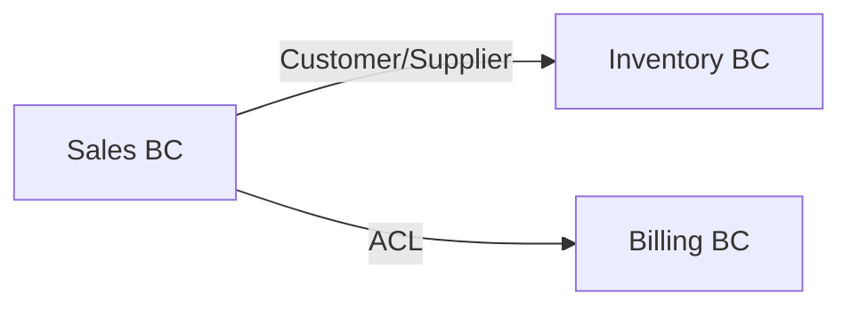
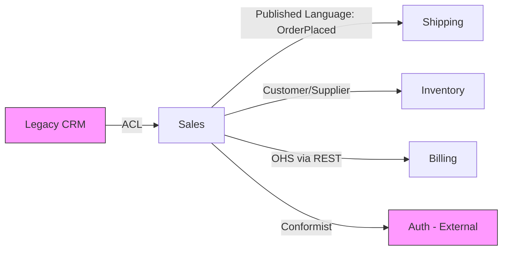

# Context Map - Nine Relationship Patterns and Mermaid Notation

A DDD Context Map makes relationships between Bounded Contexts explicit. Eric Evans and Vaughn Vernon describe nine common relationship patterns.

---

## Nine Relationship Patterns

### 1. Customer / Supplier

- **Meaning**: A downstream BC is the customer of an upstream BC and can influence upstream requirements.
- **Direction**: Upstream -> Downstream. Upstream provides, downstream consumes.
- **Example**: Sales asks Inventory to add SKU filtering to the stock API.
- **Use when**: both teams are willing to collaborate.

### 2. Conformist

- **Meaning**: The downstream BC accepts the upstream model as-is and has little or no influence.
- **Direction**: Upstream -> Downstream.
- **Example**: using an external payment gateway API exactly as provided.
- **Use when**: upstream is external or you cannot influence it.

### 3. Anti-Corruption Layer (ACL)

- **Meaning**: The downstream BC protects its model by translating upstream concepts.
- **Direction**: Upstream -> ACL -> Downstream.
- **Example**: translating a legacy `User` that mixes employee and customer concepts into a Sales `Customer`.
- **Use when**: upstream language does not fit your domain or may pollute your model.

### 4. Open Host Service (OHS)

- **Meaning**: The upstream BC exposes a public API or protocol so multiple downstream BCs can use the same interface.
- **Direction**: Upstream provides to many downstream consumers.
- **Example**: Payment BC exposes a standard REST API used by Sales, Subscription, and Marketplace.
- **Use when**: one upstream service supports several downstreams.

### 5. Published Language

- **Meaning**: A standardized data format or event schema shared across BCs. Often paired with OHS.
- **Direction**: bidirectional or many-to-many.
- **Example**: an `OrderPlaced` event defined with CloudEvents, JSON Schema, or Protobuf.
- **Use when**: event-based integration needs explicit schemas.

### 6. Partnership

- **Meaning**: Two BCs evolve together and coordinate changes.
- **Direction**: bidirectional and symmetric.
- **Example**: Sales and Inventory are owned by closely collaborating teams and deploy related features together.
- **Use when**: the two BCs are strongly linked and accept reduced autonomy.

### 7. Shared Kernel

- **Meaning**: Two BCs share part of code or model. This is strong coupling.
- **Direction**: symmetric within the shared area.
- **Example**: two BCs share the same `Money` VO library.
- **Use when**: the shared area is stable and changes rarely. Use sparingly.
- **Risk**: neither side can change freely.

### 8. Separate Ways

- **Meaning**: Two BCs do not integrate.
- **Direction**: none.
- **Example**: internal wiki and accounting system operate separately.
- **Use when**: integration cost is higher than integration value.

### 9. Big Ball of Mud

- **Meaning**: A chaotic area with unclear model boundaries and arbitrary dependencies.
- **Direction**: arbitrary.
- **Example**: an old monolith with no clear domain boundaries.
- **Use when**: do not choose it as a target; identify and isolate it, often with ACL.

---

## Mermaid Notation

### Basic Form

- `graph LR`: left-to-right flow. Use `graph TD` for top-to-bottom.
- Node: `ID[Display Name]`.
- Arrow: `A -->|relationship pattern| B`; A is upstream, B is downstream.
- Bidirectional Partnership: `A <-->|Partnership| B`.
- Separate Ways: show nodes without an arrow and explain separately.

### Complex Example

- Use `classDef` to mark external systems.
- Put the relationship pattern name on the arrow label.
- Include communication mechanism either on the arrow or in a separate table.

---

## Relationship Decision Guide

| Situation | Recommended Pattern |
|---|---|
| External system, no influence | Conformist |
| External system, need to protect your model | ACL |
| Internal BCs with collaboration and influence | Customer/Supplier |
| Same service provided to many BCs | OHS + Published Language |
| Two BCs evolve together | Partnership |
| Two BCs share common library/model | Shared Kernel, rarely |
| Integration cost exceeds value | Separate Ways |
| Area to identify and isolate | Big Ball of Mud, defended with ACL |

---

## Communication Mechanism Mapping

Relationship pattern and implementation mechanism are separate decisions. The Tech Lead decides the latter.

| Relationship Pattern | Common Communication Mechanisms |
|---|---|
| Customer/Supplier | REST API, async events |
| Conformist | REST API, external SDK, webhook |
| ACL | REST API plus adapter code |
| OHS | REST API, gRPC |
| Published Language | event messages such as Kafka or RabbitMQ |
| Partnership | any mechanism, because close collaboration dominates |
| Shared Kernel | shared library such as an npm package |
| Separate Ways | no integration, manual process |

---

## Learning Points

- The goal is not to memorize pattern names. The goal is to consciously decide how BCs communicate and who depends on whom.
- Early designs can use a small set of patterns such as Customer/Supplier, Conformist, and Published Language.
- The hard decision is often whether to add an ACL: cost versus model protection.
