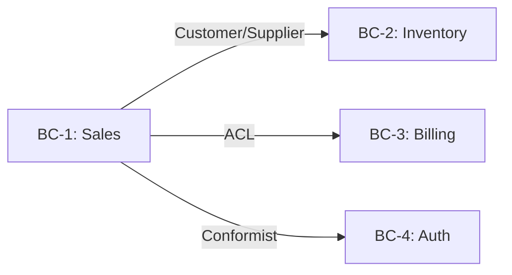

# STRATEGIC.md Output Template

This is the final format for `docs/strategic-design/STRATEGIC.md` (PRD mode) or `docs/<sub-domain>/strategic-design/STRATEGIC.md` (Socratic mode). In Phase 6, the skill consolidates Phase 1-5 artifacts into this format.

In Socratic mode, replace `<sub-domain>` with the real slice name.

---

```markdown
# {Domain Name} Strategic Design

> This document defines Bounded Contexts, Context Map, and Ubiquitous Language.
> Tactical Design such as Aggregates and VOs belongs in `../DESIGN.md`.
> Process notes are in `01-discovery.md` through `05-ubiquitous-language.md`.
> Raw debate notes are in `debates/`.

---

## 1. Domain Overview

**One-line domain definition**: {one sentence}

### Users
- **Primary users**: {primary actor plus short description}
- **Secondary users**: {secondary actors}

### Core Domain Events
- {Event 1}
- {Event 2}
- {Event 3}
- ... (5-10 events)

### Key KPIs
- {KPI 1}
- {KPI 2}

### Differentiation
{One paragraph describing differentiators compared with competitors or similar systems.}

### Out of Scope
{List of items explicitly excluded.}

---

## 2. Subdomain Classification

| Subdomain | Type | Business-Value Rationale | Differentiator |
|---|---|---|---|
| {e.g. Order Processing} | **Core** | {why this is core} | yes |
| {e.g. Payment} | Supporting | {domain-specific but not differentiating} | no |
| {e.g. Auth} | Generic | {can be replaced by external solution} | no |

**Classification rationale, summarized from the user's decision**:
{One paragraph summarizing the user's final decision after reviewing Domain Expert and Product Owner opinions.}

---

## 3. Bounded Contexts

### BC-1: {Name}

- **Responsibility**: {one paragraph describing what this BC owns}
- **Included concepts**: {5-10 major nouns}
- **Excluded concepts**: {nearby concepts that belong elsewhere and why}
- **Owning Subdomain**: Core / Supporting / Generic
- **Autonomy level**: independently deployable / deployed with another BC

### BC-2: {Name}

(Repeat the same structure.)

### BC Split Decision Rationale, Written by User

{One paragraph written by the user after the four-role Phase 3 discussion. Do not outsource this to AI.}

Raw debate: [debates/bc-boundary-{topic}.md](debates/bc-boundary-{topic}.md)

---

## 4. Context Map



### Relationship Details

| Upstream BC | Downstream BC | Pattern | Communication Mechanism | Notes |
|---|---|---|---|---|
| {e.g. Sales} | {e.g. Inventory} | Customer/Supplier | Async event | publishes OrderPlaced event |
| {e.g. LegacyBilling} | {e.g. Sales} | ACL | REST + Adapter | Sales protects its model from the legacy model |

### Context Map Rationale

{One paragraph summarizing the user's decision after reviewing Architect and Tech Lead outputs.}

---

## 5. Ubiquitous Language

### BC-1: {Sales}

| Term | Definition | Meaning in Other BCs |
|---|---|---|
| {Order} | {definition inside Sales in one sentence} | {in Shipping, source of Shipment} |
| {Customer} | {definition inside Sales} | {in Auth, User with login credentials} |

### BC-2: ...

(Repeat the same structure.)

### Same Word, Different Meaning

Cases where the same word has different meanings across BCs. This is a core Strategic Design learning point.

- **{Order}**: in Sales, purchase intent; in Shipping, input to fulfillment; in Billing, trigger for Invoice creation.
- {additional cases}

---

## 6. Learning Reflection, Written by User

### What Changed in My Thinking (PRD mode only)

Compare the final BCs in section 3 against `initial-bc-guess.md` (written before Phase 2). List, in bullets:

- Guesses that **survived** as-is.
- Guesses that were **merged** into one BC or **split** into multiple — and why.
- Guesses that were **renamed** — and what the new name captures that the old one missed.
- BCs that emerged that were **not in the initial guess** — what made them visible.

{Written directly by the user. AI must not ghostwrite this.}

### Q1. One decision most different from your initial intuition

{Written directly by the user. AI must not ghostwrite this.}

### Q2. What would you do differently next time?

{Written directly by the user.}

### Q3. How does this affect Tactical Design (`DESIGN.md`)?

{Written directly by the user. Include one or two BC-to-Aggregate mapping clues if possible.}

---

## Appendix

- Phase notes:
  - [01-discovery.md](01-discovery.md) -- Phase 1
  - [initial-bc-guess.md](initial-bc-guess.md) -- Phase 1 (PRD mode only; user's pre-debate BC guess)
  - [02-subdomains.md](02-subdomains.md) -- Phase 2
  - [03-bounded-contexts.md](03-bounded-contexts.md) -- Phase 3
  - [04-context-map.md](04-context-map.md) -- Phase 4
  - [05-ubiquitous-language.md](05-ubiquitous-language.md) -- Phase 5
- Raw debate notes: [debates/](debates/)

---

## Next Step

This Strategic Design is the starting point for Tactical Design in `../DESIGN.md`.
Next step: design Aggregates, VOs, and Entities for implementing each BC.
```

---

## Writing Notes

1. **Replace variables**: fill every `{...}` placeholder with real values.
2. **Reflection is user-written**: in Phase 6, the user must type it directly. AI must not write it for them.
3. **Validate links**: relative links such as `debates/` and `01-discovery.md` should point to real files.
4. **Validate Mermaid**: check brackets, arrow direction, and node IDs.
