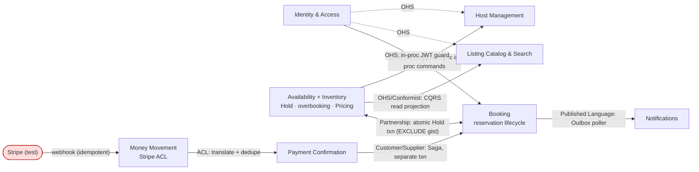

# Phase 4: Context Map

> Relationship patterns from `solution-architect`, communication mechanisms from `tech-lead`. Modular monolith (`apps/api`, one Postgres); "in-process" = a direct call within the same deployable.

## Diagram

Notation: `A -> B` = B depends on A (A upstream). `<-->` = Partnership (mutual). Reviews (deferred) omitted — no active edges yet.

## Relationship Details

| Upstream | Downstream | Pattern | Communication Mechanism | Notes |
|---|---|---|---|---|
| Availability | Booking | **Partnership** | One in-process Prisma `$transaction`: Hold write + Booking commit **atomically**. Concurrency via Postgres **`EXCLUDE USING gist`** on `(listing_id, daterange)` with `&&`. | Tightest coupling in the system; DB rejects overlaps at commit (23P01) → no double-book even under race. Trade-off: needs `btree_gist`; catch/retry the exclusion error. `version` optimistic lock is simpler but pushes overlap detection into app code and loses under contention. |
| Availability | Listing Catalog & Search | **OHS + Conformist** | CQRS **read projection** over the same Postgres (denormalized read tables/views). | Search reads never block inventory writes; read model may lag if projected async — acceptable for search. |
| Availability | Host Management | **Customer/Supplier** | Synchronous **in-process** call to the Inventory command API. | Host actions are interactive; need immediate success/failure. |
| Money Movement | Payment Confirmation | **ACL** | Inbound Stripe **webhook**, signature-verified, **idempotent on `event.id`**, raw event persisted first. | Stripe is the source of truth; dedupe table mandatory (webhooks retry/duplicate). |
| Payment Confirmation | Booking | **Customer/Supplier (Saga)** | Webhook commits PC state, then a **separate transaction** flips Booking → `Confirmed` (eventual consistency). Hold-expiry compensation = **scheduled job** releasing expired holds + cancelling unpaid bookings. | Payment and booking must not share a lock across the Stripe round-trip. |
| Booking (+ Availability / PC) | Notifications | **Conformist / Published Language** | **Transactional Outbox** row written in the confirm transaction; poller delivers **at-least-once**; consumer **idempotent on `event_id`**. | No lost/duplicate emails despite crashes. |
| Identity & Access | all guarded BCs | **OHS + Published Language** | Synchronous **in-process** JWT / claims validation per request. | Auth is a fast-path guard, not an event. |

## Context Map Rationale (summary of the two roles)

The map has exactly **one Partnership** — Availability ↔ Booking — accepted deliberately because the overbooking invariant and the reservation lifecycle must fail together at the Hold seam (one atomic transaction, DB-enforced via `EXCLUDE`). Everything else is cleanly directional: **two Customer/Supplier** edges (Inventory→Host, Payment Confirmation→Booking), **one ACL** quarantining Stripe (Money Movement→Payment Confirmation), the **read side** (Catalog & Search) as a one-way CQRS projection, generic **Identity** exposed as an Open Host Service, and **Notifications** as a pure Outbox sink nothing depends on. The only *forced async* seams are the Stripe **webhook** (external) and the **Outbox → Notifications** delivery (reliability); the Hold-expiry **scheduled job** is the safety net that makes the payment eventual-consistency window safe. No Big Ball of Mud, no accidental Shared Kernel (the `packages/shared` contract types are web↔api transport coupling, excluded from this map).
