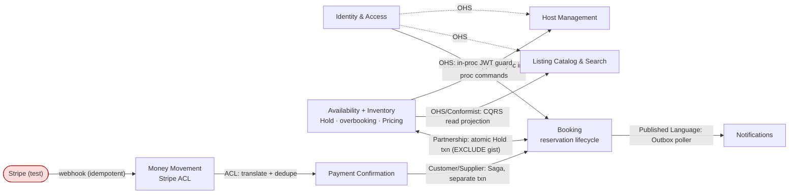

# Harbourstay Strategic Design

> This document defines Bounded Contexts, Context Map, and Ubiquitous Language.
> Tactical Design such as Aggregates and VOs belongs in `../DESIGN.md`.
> Process notes are in `01-discovery.md` through `05-ubiquitous-language.md`.
> Raw debate notes are in `debates/`.
>
> **Status:** Complete (Phases 1–6, 2026-07-02). Next: Tactical Design in `../DESIGN.md`.

---

## 1. Domain Overview

**One-line domain definition**: An OTA where guests reserve short stays/tours and hosts manage availability, differentiated by overbooking prevention and reliable payment confirmation.

### Users
- **Primary**: Guest (booker) — searches, reserves, pays, manages bookings.
- **Secondary**: Host / Operator (supplier); Admin (stretch).

### Core Domain Events
HoldPlaced · BookingCreated (PendingPayment) · PaymentIntentCreated · PaymentSucceeded/Failed · BookingConfirmed · BookingExpired · BookingCancelled · BookingCompleted · ConfirmationEmailRequested

### Key KPIs
End-to-end booking success · zero double-bookings · search p95 < 500 ms

### Differentiation
The rich booking domain: real concurrency control (overbooking prevention) and reliable payment confirmation (Saga + Transactional Outbox) are the differentiators, not the surrounding CRUD.

### Out of Scope
Multi-tenancy / production-scale rollout; deep security/audit/compliance; native mobile / real-time chat / ML recommendations; real settlement & refund accounting (Stripe test mode only).

---

## 2. Subdomain Classification

| Subdomain | Type | Business-Value Rationale | Differentiator |
|---|---|---|---|
| Booking Lifecycle | **Core** | The reservation state machine is *the* product; drives the top KPI. | yes |
| Availability / Overbooking Prevention | **Core** | "Same night never sold twice" — the strongest differentiator. | yes (strongest) |
| Payment Confirmation (reconciliation) | **Core** | "When is a booking *truly paid*?" — the reliable-confirmation promise. | yes |
| Payment Money-Movement (Stripe) | Generic | Commodity charge/settlement, isolated behind an ACL. | no |
| Pricing / Rate Rules | Supporting | Rates/discounts/fees serve booking; MVP survives on a snapshot. | no |
| Listing Catalog & Search | Supporting | Table-stakes discovery; competitors match it. | no |
| Host Management | Supporting | Supply-side entry; no guest-visible edge. | no |
| Reviews | Supporting | Retention/trust later; irrelevant to first booking. | no |
| Identity & Access | Generic | Commodity auth. | no |
| Notifications | Generic | Universal; the *decision* to notify belongs to Booking. | no |

**Rationale (user decision)**: adopted the two roles' convergent Core trio (Booking, Availability/Overbooking, Payment Confirmation); accepted splitting the "Inventory" lump into a Supporting *catalog* and a Core *availability* invariant; chose the finer split of Payments — Stripe money-movement **Generic** (behind ACL), reconciliation **Core**. Full detail: [02-subdomains.md](02-subdomains.md).

---

## 3. Bounded Contexts

Nine logical BCs, co-deployed in the `apps/api` modular monolith (one Postgres).

| # | BC | Class | Responsibility (short) |
|---|---|---|---|
| 1 | **Booking** | Core | Reservation lifecycle (PendingPayment→Confirmed→Completed/Cancelled/Expired/NoShow); references a Hold. |
| 2 | **Availability & Inventory** | Core | Owns the Hold + overbooking invariant + canonical Listing; **Pricing folded in** (seam to split later). |
| 3 | **Payment Confirmation** | Core | Reconciliation ("truly paid"); idempotent webhook; drives Booking→Confirmed via Saga. |
| 4 | **Money Movement** | Generic | Stripe (test) behind an Anti-Corruption Layer. |
| 5 | **Listing Catalog & Search** | Supporting | CQRS read-side "marketed offer" view over Inventory. |
| 6 | **Host Management** | Supporting | Host command surface over Inventory (deferred P4). |
| 7 | **Identity & Access** | Generic | Users, roles (guest/host/admin), JWT. |
| 8 | **Notifications** | Generic | Async Outbox consumer; owns no invariant. |
| 9 | **Reviews** | Supporting | Post-stay ratings (deferred / Could). |

Full responsibilities, included/excluded concepts, and autonomy per BC: [03-bounded-contexts.md](03-bounded-contexts.md).

### BC Split Decision Rationale (user's words)

"Availability is a listing of products. Booking is how a user owns the inventory."

Key moves vs the initial guess: **Booking** survived; **Inventory** split into the supply-invariant (Availability) + the read side (Catalog & Search); **Pricing** folded into Availability (not standalone); five further contexts surfaced (Payment Confirmation, Money Movement, Identity, Notifications, Host, Reviews). Raw debate: [debates/bc-identification-round1.md](debates/bc-identification-round1.md).

---

## 4. Context Map

| Upstream | Downstream | Pattern | Mechanism |
|---|---|---|---|
| Availability | Booking | **Partnership** | One in-process transaction; Hold + Booking commit atomically; Postgres `EXCLUDE` on `(listing_id, daterange)`. |
| Availability | Catalog & Search | OHS + Conformist | CQRS read projection over the same Postgres. |
| Availability | Host Management | Customer/Supplier | Sync in-process command call. |
| Money Movement | Payment Confirmation | ACL | Stripe webhook, signature-verified, idempotent on `event.id`. |
| Payment Confirmation | Booking | Customer/Supplier (Saga) | Separate transaction flips Booking→Confirmed; Hold-expiry via scheduled job. |
| Booking (+Avail/PC) | Notifications | Conformist / Published Language | Transactional Outbox row in confirm txn; poller at-least-once, idempotent. |
| Identity & Access | all guarded BCs | OHS + Published Language | Sync in-process JWT/claims guard. |

**Rationale**: exactly one Partnership (Availability↔Booking, accepted because the overbooking invariant and reservation lifecycle must fail together at the Hold seam, DB-enforced via `EXCLUDE`); everything else cleanly directional. Only forced async seams: the Stripe webhook and Outbox→Notifications; Hold-expiry scheduled job is the safety net. Full detail: [04-context-map.md](04-context-map.md).

---

## 5. Ubiquitous Language

Full per-BC glossary (~60 terms): [05-ubiquitous-language.md](05-ubiquitous-language.md). The load-bearing **same-word-different-meaning** cases:

| Word | Meanings across BCs |
|---|---|
| **Hold** | Inventory = real TTL claim on nights (owner); Booking = a pointer. *"A hold protects; a reservation commits."* |
| **Guest** | Booking = the booker (person); Availability = party-size (count); Identity = the `guest` role. |
| **Availability** | Inventory = live/contested/truthful; Catalog = approximate hint. Shown-available ≠ is-available. |
| **Listing** | Inventory = canonical unit; Catalog = marketed view; Host = editable draft; Booking = referenced identity. |
| **PaymentIntent** | Money Movement = Stripe's object; Payment Confirmation = our purified model (why the ACL exists). |
| **Confirmed** | Booking = reservation secured; Payment Confirmation = money settled; Notifications = the email. Cause → effect → announcement; never collapse. |
| **Reservation** | Booking = the paperwork/aggregate; Inventory = the permanent taking of nights. |
| **Price/Rate** | Rate = per-night; Price = quoted total; Price Snapshot = frozen agreed total (Booking); "From" price = teaser. |
| **Book (verb)** | The whole saga (hold→settle→confirm), vs Booking the noun (aggregate). |

Two named tensions: the Availability gap (search approximate vs inventory truthful) is **intentional**; "Confirmed" must **never** be defined as "paid."

---

## 6. Learning Reflection, Written by User

### What Changed in My Thinking (vs `initial-bc-guess.md`)

Factual comparison (initial guess → final):
- **Survived:** Booking — kept as-is (Core).
- **Split:** Inventory → Availability & Inventory (overbooking invariant, Core) + Listing Catalog & Search (read side, Supporting).
- **Folded:** Pricing → into Availability & Inventory (not a standalone BC; documented seam to split later).
- **Emerged (not guessed):** Payment Confirmation, Money Movement, Identity & Access, Notifications, Host Management, Reviews.

User's words: "I didn't check PRD carefully."

### Q1. One decision most different from your initial intuition

"I didn't know Pricing can be a BC."

### Q2. What would you do differently next time?

"I would have more time reading PRD."

### Q3. How does this affect Tactical Design (`DESIGN.md`)?

"No idea." _(To revisit when writing DESIGN.md — pick one BC, e.g. Booking, and name an Aggregate candidate.)_

---

## Appendix

- Phase notes: [01-discovery.md](01-discovery.md) · [initial-bc-guess.md](initial-bc-guess.md) · [02-subdomains.md](02-subdomains.md) · [03-bounded-contexts.md](03-bounded-contexts.md) · [04-context-map.md](04-context-map.md) · [05-ubiquitous-language.md](05-ubiquitous-language.md)
- Raw debate notes: [debates/](debates/)

---

## Next Step

This Strategic Design is the starting point for Tactical Design in `../DESIGN.md`: map each BC to Aggregates, VOs, and Entities. Implementation then follows the `fullstack-build` skill (PRD §12 milestones).
